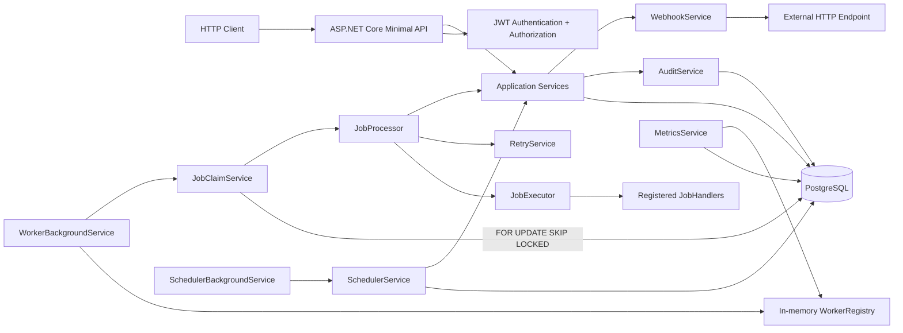
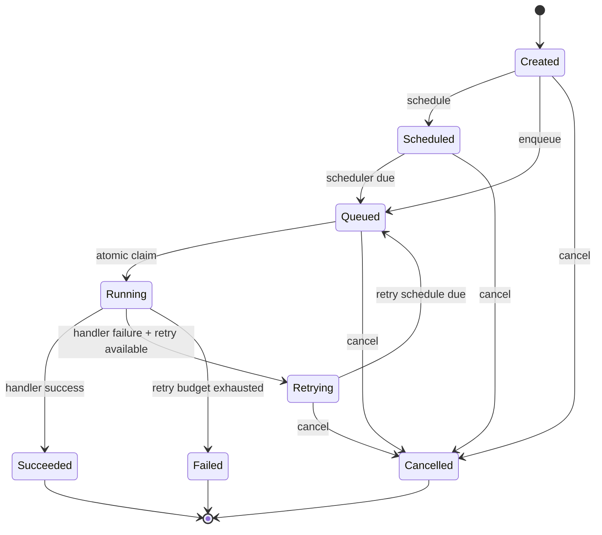

# JobForge

> Durable background job orchestration backend built with .NET, PostgreSQL, EF Core, JWT authentication, atomic queue claiming, runtime workers, delayed scheduling, retry/backoff, audit, metrics, and crash recovery.

[](https://github.com/Pval-Dev/JobForge/actions/workflows/ci.yml)


JobForge is a backend portfolio project focused on the systems behind reliable background job processing. It exposes a Minimal API for creating, scheduling, queueing, inspecting, and cancelling jobs while background workers claim work from PostgreSQL and execute registered handlers.

The project focuses on backend architecture rather than UI development: domain state transitions, persistence boundaries, concurrent work claiming, authentication and authorization, background services, retries, observability, recovery, and outbound HTTP delivery.

---

## Engineering Goals

JobForge was designed around concrete backend problems:

- keep queued work durable across process restarts;
- prevent two workers from claiming the same queued job;
- model job state transitions explicitly instead of relying on ad-hoc flags;
- support delayed work and retry scheduling;
- separate HTTP authority from internal runtime authority;
- protect resources with JWT authentication, role-based authorization, and ownership checks;
- preserve an audit trail for important state changes;
- expose runtime/job metrics without leaking internal entities;
- recover jobs left `Running` after an interrupted process;
- support owner-scoped outbound webhook delivery and delivery testing.

---

## Architecture



The persistence boundary is intentional:

```text
Durable in PostgreSQL
├── Jobs
├── Users
├── Audit entries
├── Schedules
├── Retry attempts
└── Webhook registrations

Runtime-only in memory
└── Worker instances
```

Workers represent execution capacity, not durable work. If the process restarts, workers disappear, but queued/scheduled/retrying jobs remain in PostgreSQL and can be processed after workers are registered again.

---

## Core Job Lifecycle



The domain entity owns these transitions. Services orchestrate persistence and audit around them.

---

## Technical Highlights

### Atomic queue claiming

The queue's concurrency-critical path is implemented directly against PostgreSQL:

```sql
SELECT *
FROM "Jobs"
WHERE "Status" = @Queued
ORDER BY "Priority" DESC, "QueuedAt" ASC
LIMIT 1
FOR UPDATE SKIP LOCKED;
```

Each worker processes work inside its own DI scope and EF Core `DbContext`. `FOR UPDATE SKIP LOCKED` prevents competing workers from claiming the same row while still allowing them to claim different jobs without serializing the entire queue.

### Durable retry scheduling

Failed jobs persist retry attempts with their next retry timestamp. `RetryPolicy` uses exponential backoff, while `SchedulerBackgroundService` promotes due retry schedules back into the queue.

### Crash recovery

On startup, `JobRecoveryService` finds jobs still persisted as `Running`. Because their original runtime worker no longer exists after a restart, they are routed through the retry/failure pipeline instead of remaining orphaned indefinitely.

### Secure-by-default HTTP API

A fallback authorization policy requires authentication for every route unless explicitly marked anonymous. Registration/login opt out, while administrative routes use an `AdminOnly` policy. Job ownership is derived from the authenticated JWT identity rather than accepted from request bodies.

### Password handling

Passwords are never stored directly. ASP.NET Core Identity `IPasswordHasher<User>` produces the persisted hash, and login returns the same generic error for a missing user and an invalid password to reduce username-enumeration leakage.

### Observability

JobForge exposes durable lifecycle audit entries, job status/success metrics, runtime worker availability/utilization metrics, and centralized `ProblemDetails`-style HTTP error responses.

---

## Runtime Flow

A successful `ECHO` job crosses the complete stack:

```text
POST /jobs
→ authenticated owner derived from JWT
→ JobService creates Job
→ PostgreSQL persists Created
→ POST /jobs/{id}/queue
→ Queued + QueuedAt persisted
→ WorkerBackgroundService finds an idle worker
→ JobClaimService atomically claims one queued row
→ Job becomes Running
→ JobProcessor assigns worker
→ JobExecutor selects the ECHO handler
→ handler returns JobResult(success: true)
→ Job becomes Succeeded
→ audit trail persists lifecycle events
→ worker returns to Idle
→ GET /jobs/{id} exposes final result
```

A failing handler enters the retry/scheduler loop until the retry budget is exhausted.

---

## Verified End-to-End Flow

The included smoke runner was executed against the running API and verified:

| Capability | Result |
|---|---|
| Admin login and JWT issuance | Passed |
| Normal-user registration | Passed |
| `401` without authentication | Passed |
| `403` for non-admin access | Passed |
| Runtime worker creation | Passed |
| Job creation and queueing | Passed |
| Atomic worker claim and execution | Passed |
| `ECHO` success path | Passed |
| Worker returns to `Idle` | Passed |
| Retry + scheduler path | Passed |
| Final failure after retry exhaustion | Passed |
| Job and worker metrics | Passed |
| Audit lifecycle entries | Passed |

The E2E runner is available at [`scripts/e2e.ps1`](scripts/e2e.ps1).

---

## Tech Stack

| Area | Technology |
|---|---|
| Runtime | .NET 10 |
| HTTP API | ASP.NET Core Minimal APIs |
| Persistence | Entity Framework Core |
| Database | PostgreSQL via Npgsql |
| Authentication | JWT Bearer |
| Password hashing | ASP.NET Core Identity `PasswordHasher<TUser>` |
| Background processing | `BackgroundService`, DI scopes |
| Concurrency | PostgreSQL row locking with `SKIP LOCKED` |
| API documentation | OpenAPI |
| Testing | HTTP request collection + PowerShell E2E smoke runner |
| CI | GitHub Actions build workflow |

---

## Repository Structure

```text
JobForge/
├── Audit/                 # Durable lifecycle audit model/service
├── Auth/                  # Login, registration, JWT, admin bootstrap
├── Common/                # Shared validation and global HTTP errors
├── EndPoints/             # Minimal API route modules and DTOs
├── Jobs/                  # Job aggregate, lifecycle, results, priority
├── Metrics/               # Job and runtime-worker metrics
├── Migrations/            # EF Core database schema
├── Persistence/           # DbContext and repositories
├── Queues/                # Durable enqueue + atomic claim path
├── Retries/               # Retry attempts and exponential backoff
├── Scheduling/            # Delayed/retry schedules + background polling
├── Users/                 # User domain, password-backed service, roles
├── Webhooks/              # Owner-scoped registrations and HTTP delivery
├── Workers/               # Runtime worker pool, processor, handlers, recovery
├── diagrams/              # Mermaid architecture sources
├── docs/                  # Engineering documentation
├── requests/              # Manual HTTP request collection
├── scripts/               # Automated E2E smoke runner
└── .github/workflows/     # CI build
```

---

## API Surface

| Route group | Purpose | Access |
|---|---|---|
| `/auth` | Register and login | Anonymous |
| `/users` | Current profile and user administration | Authenticated / Admin |
| `/jobs` | Create, inspect, queue, schedule, cancel | Owner or Admin |
| `/workers` | Runtime worker management | Admin |
| `/metrics` | Job and worker metrics | Admin |
| `/audit` | Audit inspection | Admin |
| `/webhooks` | Owner-scoped webhook registrations and delivery tests | Authenticated / Admin |

See [`docs/api.md`](docs/api.md) for the full endpoint reference.

---

## Local Setup

### Prerequisites

- .NET 10 SDK
- PostgreSQL
- `dotnet-ef`

### 1. Restore packages

```powershell
dotnet restore
```

### 2. Configure local secrets

The repository intentionally contains no database passwords, JWT keys, or bootstrap administrator credentials.

```powershell
dotnet user-secrets set "ConnectionStrings:JobForgeDatabase" "Host=localhost;Port=5432;Database=JobForge;Username=postgres;Password=YOUR_PASSWORD"
dotnet user-secrets set "Jwt:Key" "REPLACE_WITH_A_RANDOM_SECRET_AT_LEAST_32_BYTES_LONG"
```

For the first administrator only:

```powershell
dotnet user-secrets set "BootstrapAdmin:Username" "JobForgeAdmin"
dotnet user-secrets set "BootstrapAdmin:Password" "YOUR_STRONG_ADMIN_PASSWORD"
```

### 3. Apply migrations

```powershell
dotnet ef database update
```

### 4. Run

```powershell
dotnet run
```

Development defaults to `http://localhost:5177`.

After the initial administrator is confirmed, remove only the bootstrap credentials:

```powershell
dotnet user-secrets remove "BootstrapAdmin:Username"
dotnet user-secrets remove "BootstrapAdmin:Password"
```

The persisted Admin remains in PostgreSQL with its password hash.

---

## Running the E2E Smoke Test

Keep JobForge running and open another PowerShell session:

```powershell
$env:JOBFORGE_ADMIN_PASSWORD = "YOUR_ADMIN_PASSWORD"
.\scripts\e2e.ps1
Remove-Item Env:JOBFORGE_ADMIN_PASSWORD
```

For a faster smoke pass that skips intentional retry/backoff:

```powershell
.\scripts\e2e.ps1 -AdminPassword "YOUR_ADMIN_PASSWORD" -SkipRetry
```

Manual examples are available in [`requests/JobForge.http`](requests/JobForge.http).

---

## Documentation

1. [`docs/architecture.md`](docs/architecture.md)
2. [`docs/design-decisions.md`](docs/design-decisions.md)
3. [`docs/api.md`](docs/api.md)
4. [`docs/security.md`](docs/security.md)
5. [`docs/testing.md`](docs/testing.md)
6. [`docs/engineering-summary.md`](docs/engineering-summary.md)

Mermaid source diagrams are under [`diagrams/`](diagrams/).

---

## Design Scope and Known Limitations

JobForge is a portfolio backend, not a claim of production-scale distributed infrastructure.

Current boundaries are deliberate and documented:

- workers live in memory and are recreated after process restart;
- job/schedule/retry/audit state is durable, but multi-instance scheduler leader election is not implemented;
- repositories use synchronous EF Core operations outside the atomic claim path;
- JWT access tokens do not implement refresh-token rotation or immediate token revocation;
- a role change is fully reflected after a new token is issued or the previous token expires;
- webhook URL validation accepts HTTP/HTTPS, but production-grade SSRF/network egress hardening is outside the current scope;
- webhook HTTP delivery is implemented and can be exercised through the delivery test endpoint; automatic dispatch from every job terminal event is not currently wired into the processor;
- the repository includes an automated E2E smoke runner but not a dedicated unit/integration test project.

These tradeoffs are covered in [`docs/design-decisions.md`](docs/design-decisions.md) and [`docs/security.md`](docs/security.md).

---

## What This Project Demonstrates

JobForge demonstrates practical experience with backend domain modeling and state machines, ASP.NET Core request/response boundaries, dependency injection and service lifetimes, PostgreSQL/EF Core persistence, concurrency-safe queue claiming, background processing, scheduling, durable retries, authentication and authorization, password hashing and JWT issuance, crash recovery, audit/metrics, outbound HTTP integration, migration-driven schema evolution, reproducible E2E verification, and technical architecture documentation.

---

## Status

**Completed portfolio project.**

The implementation is intentionally feature-frozen. Further work would focus on production hardening—distributed coordination, rate limiting, refresh/revocation, async persistence, a dedicated test suite, and webhook egress policy—rather than adding more product features.

---

## Author

Developed by **Pval-Dev** as a backend systems portfolio project.
