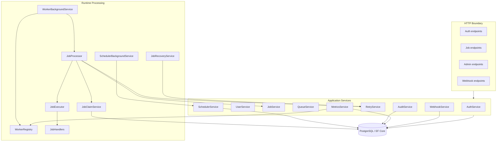

# Architecture

JobForge is organized around explicit boundaries between HTTP transport, domain behavior, application orchestration, persistence, and runtime processing.

## High-level view



## Layer responsibilities

| Layer | Responsibility |
|---|---|
| EndPoints | HTTP routes, request DTOs, response DTOs, authorization boundary |
| Domain | Job/user/worker state transitions and invariants |
| Services | Application use cases and orchestration |
| Persistence | EF Core mapping and repository access |
| Runtime | Worker polling, atomic claim, execution, retry, recovery |
| Infrastructure | JWT, PostgreSQL, HTTP clients, logging, OpenAPI |

## Job aggregate

`Job` is the central durable aggregate. It owns state transitions such as `Schedule`, `Enqueue`, `Start`, `Retry`, `Succeed`, `Fail`, and `Cancel`.

Services do not set job state directly. They call domain methods, persist the resulting state, and record audit events. This keeps invalid transitions close to the entity instead of distributing them across endpoints and background services.

## Persistence model

PostgreSQL stores the durable business/runtime state: `Jobs`, `Users`, `AuditEntries`, `Schedules`, `RetryAttempts`, and `Webhooks`.

`WorkerRegistry` is intentionally in-memory. A worker represents currently available process capacity. It is not durable work and therefore does not need to survive an application restart.

## Request scope vs background scope

ASP.NET Core HTTP requests receive scoped services and a scoped `JobForgeDbContext` through dependency injection. Background workers cannot share one scoped `DbContext` across concurrent tasks. `WorkerBackgroundService` therefore creates a new DI scope for each worker processing operation.

```text
WorkerBackgroundService
→ CreateScope()
→ resolve JobProcessor
→ resolve scoped repositories/services/DbContext
→ process one job
→ dispose scope
```

## Atomic queue claim

The critical queue claim path uses a PostgreSQL transaction and row-level lock:

```sql
SELECT *
FROM "Jobs"
WHERE "Status" = @Queued
ORDER BY "Priority" DESC, "QueuedAt" ASC
LIMIT 1
FOR UPDATE SKIP LOCKED;
```

The selected job is moved to `Running` before the transaction commits. `SKIP LOCKED` lets competing workers claim different rows without waiting on an already-claimed job.

## Scheduling and retries

Delayed jobs are persisted as `Schedule` rows. `SchedulerBackgroundService` wakes periodically, loads due active schedules, enqueues their jobs, and deactivates the consumed schedule.

Retry scheduling reuses the same mechanism. `RetryService` creates a persisted `RetryAttempt`, computes the next delay, moves the job to `Retrying`, and asks `SchedulerService` to create a retry schedule.

## Crash recovery

Workers are runtime-only, but a job can remain persisted as `Running` when the process terminates unexpectedly.

```text
JobRecoveryService
→ query Jobs where Status == Running
→ treat each as an interrupted execution
→ route through RetryService
→ retry later or fail if retry budget is exhausted
```

## Internal authority

The HTTP API deliberately does not expose runtime-only actions such as claiming a job, marking a job as running, reporting arbitrary success/failure from a client, processing due schedules, or dequeuing directly. Those actions belong to the server runtime.